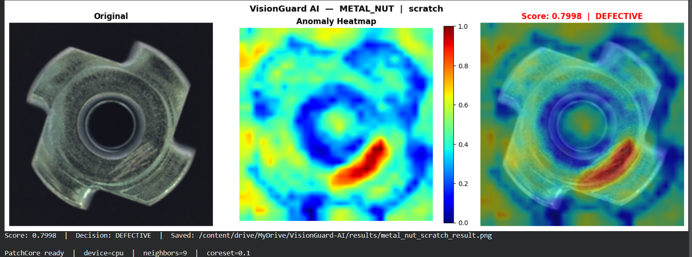
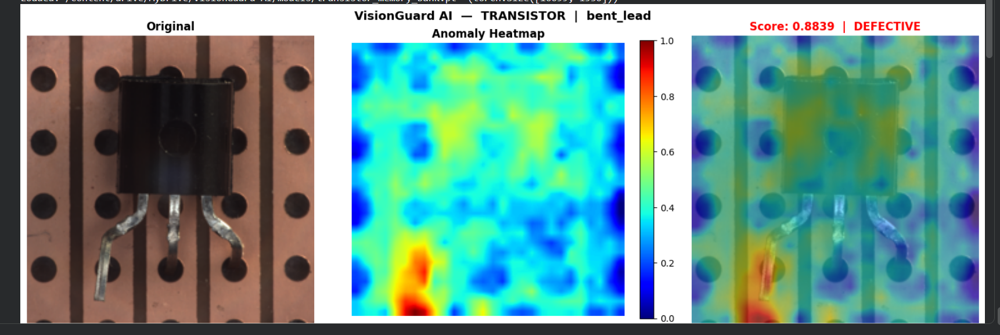

# VisionGuard AI

**Industrial AI Quality Control System**

An end-to-end, domain-agnostic quality control platform that combines computer vision, large language models, and multi-agent AI to automate defect detection on manufacturing production lines.

> Trained only on normal images. No defect data required.

---

## Demo

**Metal Nut — Scratch Detection**



**Transistor — Bent Lead Detection**



The system localizes defects at the pixel level and delivers a Pass / Rework / Quarantine decision with a plain-language explanation — within 2 seconds of image input.

---

## What it does

A part image enters the pipeline. VisionGuard AI runs anomaly detection, generates a heatmap showing exactly where the defect is, passes the result through four specialized AI agents, and presents the operator with a full inspection report and decision all automatically.

```
Image Input
    ↓
PatchCore Anomaly Detection  →  anomaly score + heatmap
    ↓
Agent 1: Vision Inspector    →  structures CV output
    ↓
Agent 2: Report Writer       →  human-readable inspection report
    ↓
Agent 3: Root Cause Analyst  →  queries inspection history, reasons about cause
    ↓
Agent 4: Decision Router     →  PASS / REWORK / QUARANTINE + justification
    ↓
React Dashboard              →  live heatmap, streaming report, analytics
```

---

## Key features

| Feature                                                   | Status         |
| --------------------------------------------------------- | -------------- |
| PatchCore anomaly detection (pure PyTorch)                | ✅ Complete    |
| Pixel-level heatmap generation                            | ✅ Complete    |
| 99–100% AUROC on MVTec AD benchmark                       | ✅ Complete    |
| Domain-agnostic — swap training images to change industry | ✅ Complete    |
| LangGraph multi-agent orchestration                       | 🔄 In Progress |
| LLM-powered inspection report generation                  | 🔄 In Progress |
| Root cause analysis with ChromaDB RAG                     | 🔄 In Progress |
| Pass / Rework / Quarantine decision routing               | 🔄 In Progress |
| FastAPI backend with WebSocket streaming                  | 📅 Planned     |
| React real-time dashboard                                 | 📅 Planned     |
| Docker deployment with public URL                         | 📅 Planned     |
| Physical demo — conveyor belt + camera                    | 📅 Future      |

---

## Why domain-agnostic matters

Most quality control systems are built for one product and one factory. Reconfiguring them for a new product takes months of retraining and engineering work.

VisionGuard AI separates the intelligence from the domain. The CV model, the agents, the dashboard, and the deployment pipeline never change. Switching from inspecting metal nuts to inspecting transistors to inspecting leather panels is a configuration change — not a rebuild.

The same system pitches to an electronics manufacturer on Monday and an automotive supplier on Friday.

---

## Benchmark results

Trained on the MVTec Anomaly Detection dataset the global benchmark for industrial anomaly detection. Every serious paper in this field reports results on MVTec AD.

| Category   | Industry                     | AUROC   | Status           |
| ---------- | ---------------------------- | ------- | ---------------- |
| metal_nut  | Automotive / Industrial      | 100.00% | Production Ready |
| transistor | Electronics Manufacturing    | 99.04%  | Production Ready |
| leather    | Automotive Interior / Luxury | 100.00% | Production Ready |

---

## Technology stack

| Layer               | Technology                                           |
| ------------------- | ---------------------------------------------------- |
| Computer Vision     | PyTorch + WideResNet50 (pretrained, frozen)          |
| Anomaly Detection   | PatchCore — memory bank + greedy coreset subsampling |
| Agent Orchestration | LangGraph                                            |
| LLM                 | GPT-4o / Claude Sonnet                               |
| Vector Memory       | ChromaDB                                             |
| Backend             | FastAPI + Uvicorn                                    |
| Frontend            | React + Recharts + Canvas API                        |
| Deployment          | Docker Compose + Railway                             |
| Dataset             | MVTec AD (CC BY-NC-SA 4.0)                           |

---

## Project structure

```
visionguard-ai/
│
├── backend/
│   ├── agents/          # 4 LangGraph agents
│   ├── cv/              # PatchCore implementation
│   ├── memory/          # ChromaDB client
│   ├── api/             # FastAPI routes and WebSocket
│   ├── main.py          # Application entry point
│   └── requirements.txt
│
├── frontend/
│   └── src/
│       ├── components/  # InspectionFeed, ReportPanel, Dashboard...
│       ├── hooks/        # useWebSocket, useHeatmap...
│       ├── store/        # Zustand state management
│       └── services/     # API communication layer
│
├── notebooks/
│   └── visionguard_patchcore_training.ipynb  # Phase 2 training notebook
│
├── docs/
│   ├── images/          # Demo screenshots
│   └── VisionGuard_AI_Project_Proposal.pdf
│
├── docker/
│   ├── Dockerfile.backend
│   └── Dockerfile.frontend
│
├── docker-compose.yml
├── .env.example
└── README.md
```

---

## Getting started

### Prerequisites

- Python 3.11
- Node.js 18+
- Git

### Backend setup

```bash
git clone https://github.com/SalimHossain118/visionguard-ai.git
cd visionguard-ai

python -m venv venv
source venv/Scripts/activate  # Windows
# source venv/bin/activate    # Mac / Linux

pip install -r backend/requirements.txt

cp .env.example .env
# Add your OPENAI_API_KEY to .env

uvicorn backend.main:app --reload
```

API is available at `http://localhost:8000`  
Swagger docs at `http://localhost:8000/docs`

### Model setup

The trained PatchCore models are not included in the repository (file size).
To train your own models, open `notebooks/visionguard_patchcore_training.ipynb` in Google Colab and follow the steps from the top.

---

## How the CV model works

PatchCore takes a different approach from traditional defect classifiers. Instead of learning what defects look like, it learns what normal looks like then flags anything that deviates.

A pretrained WideResNet50 extracts patch-level features from normal training images. These features are stored in a memory bank after greedy coreset subsampling reduces the bank to 10% of its original size while preserving maximum coverage. At inference time, each patch of the new image is compared to the memory bank using k-nearest neighbor distance. High distance means anomaly. The spatial distribution of distances becomes the heatmap.

This approach works in factories because defect images are rare by definition. If defects were common, the factory would have shut down already. Normal images are always available.

---

## How the agents work

Four agents collaborate through a LangGraph orchestration graph. Each agent has exactly one responsibility.

**Vision Inspector** receives the raw PatchCore output and structures it into a standardized inspection record with defect location, severity, and spatial coverage.

**Report Writer** takes that record and produces a human-readable report. Written in language a factory operator understands — no AI or data science knowledge required.

**Root Cause Analyst** queries ChromaDB for similar past inspections and reasons about probable causes. Identifies process drift when the same defect pattern repeats across shifts.

**Decision Router** combines all three outputs and applies business rules to produce a final decision: PASS, REWORK, or QUARANTINE. Explains the decision in one sentence.

---

## Roadmap

- [x] Phase 1 — Foundation: project structure, FastAPI, versioned endpoints
- [x] Phase 2 — Computer Vision: PatchCore training, evaluation, heatmap generation
- [ ] Phase 3 — LangGraph Agents: 4 agents, LLM integration, ChromaDB RAG
- [ ] Phase 4 — Full Backend: pipeline integration, WebSocket streaming
- [ ] Phase 5 — React Dashboard: live heatmap, streaming report, analytics
- [ ] Phase 6 — Deployment: Docker, Railway, public URL
- [ ] Phase 7 — Physical Demo: conveyor belt, webcam, edge inference

---

## About

Built by **Salim Hossain** — AI Engineer (MSc AI & Intelligent Systems, EPITA Paris),
Full-Stack Software Engineer (3+ years, React / Node.js / Java/Python), and CNC Programmer
with hands-on machining experience to 0.01mm tolerance.

That last part matters. Most engineers who build industrial AI systems have never stood on a factory floor. The agent reasoning in VisionGuard AI reflects real manufacturing knowledge — how defects actually happen, what operators actually need to see, and what decisions actually make sense in a production environment.

---

_VisionGuard AI is under active development. Star the repository to follow progress._
