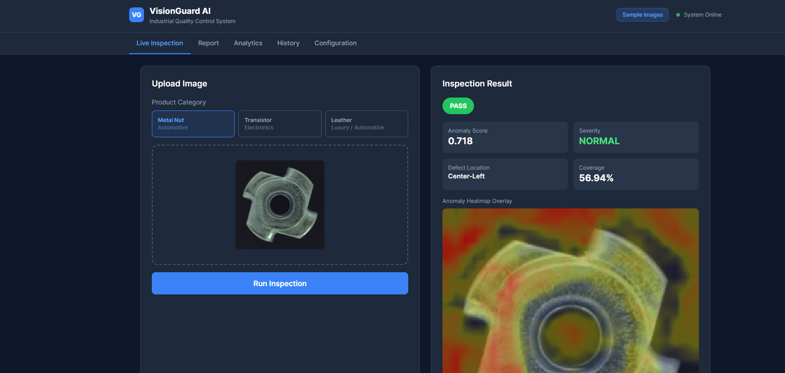
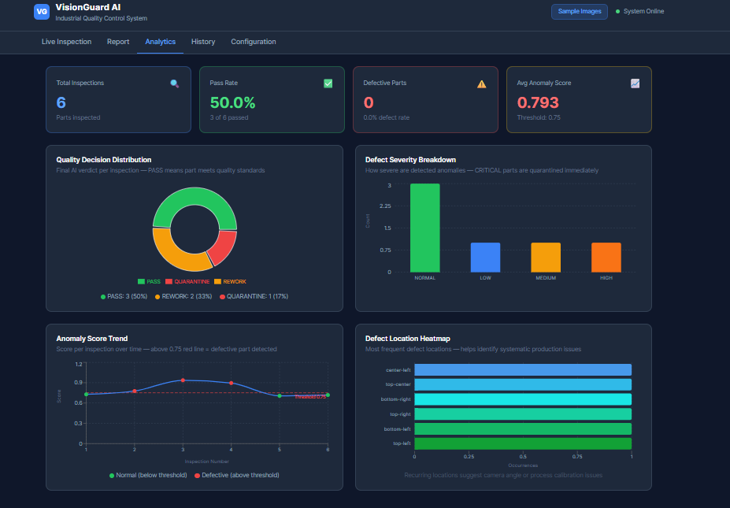
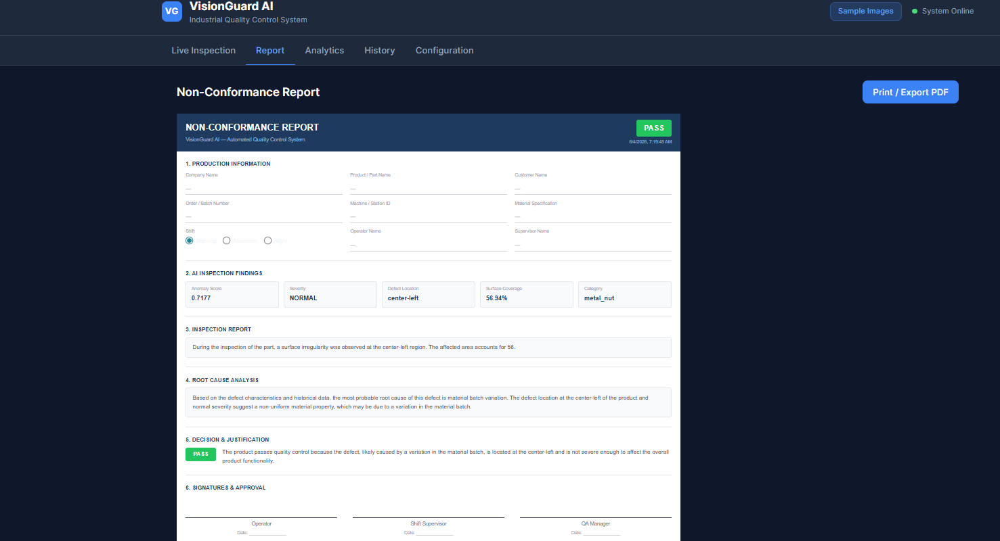

<div align="center">

# 🏭 VisionGuard AI

### Industrial AI Quality Control System

**Computer Vision · Multi-Agent AI · Real-Time Decision Making**

[](https://salim118-visionguard-ai.hf.space)
[](https://github.com/SalimHossain118/visionguard-ai)
[](https://python.org)
[](https://pytorch.org)
[](https://fastapi.tiangolo.com)
[](https://react.dev)
[](https://docker.com)

---

**An end-to-end industrial quality control platform combining PatchCore computer vision, LangGraph multi-agent AI, and a real-time React dashboard — trained only on normal images, no defect data required.**

[**🚀 Try Live Demo**](https://salim118-visionguard-ai.hf.space) · [**📖 Architecture**](#architecture) · [**🎯 Benchmark**](#benchmark-results)

</div>

---

## 📸 Screenshots

### Live Inspection — Pixel-Level Defect Detection



### Analytics Dashboard — Production Quality Metrics



### NCR Report — ISO 9001 Non-Conformance Report



---

## ⚡ What It Does

A part image enters the pipeline. VisionGuard AI runs anomaly detection, generates a pixel-level heatmap, passes results through 4 specialized AI agents, and delivers a **PASS / REWORK / QUARANTINE** decision with a human-readable report — automatically.

```
📸 Image Input
      ↓
🔬 PatchCore CV Model          →  anomaly score (0–1) + heatmap
      ↓
🤖 Agent 1: Vision Inspector   →  defect location, severity, coverage %
      ↓
📝 Agent 2: Report Writer      →  plain-language inspection report
      ↓
🔍 Agent 3: Root Cause Analyst →  queries history, identifies patterns
      ↓
⚖️  Agent 4: Decision Router    →  PASS / REWORK / QUARANTINE + justification
      ↓
📊 React Dashboard             →  live heatmap, NCR report, analytics
```

---

## 🎯 Live Demo

**[→ Open VisionGuard AI](https://salim118-visionguard-ai.hf.space)**

Click **Sample Images** in the top bar — no upload needed.

| Category   | Industry                     | What It Detects                             |
| ---------- | ---------------------------- | ------------------------------------------- |
| Metal Nut  | Automotive / Industrial      | Scratch, bend, color defect, flip           |
| Transistor | Electronics Manufacturing    | Bent leads, damaged case, misplacement      |
| Leather    | Automotive Interior / Luxury | Cuts, folds, glue contamination, poke marks |

> ⏱️ First inspection takes 15–30 seconds — models load on cold start.

---

## 📊 Benchmark Results

Trained and evaluated on **MVTec AD** — the global benchmark for industrial anomaly detection.

| Category   | Industry            | AUROC       | Threshold | Status              |
| ---------- | ------------------- | ----------- | --------- | ------------------- |
| metal_nut  | Automotive          | **100.00%** | 0.75      | ✅ Production Ready |
| transistor | Electronics         | **99.04%**  | 0.75      | ✅ Production Ready |
| leather    | Luxury / Automotive | **100.00%** | 0.75      | ✅ Production Ready |

### Why near-100% AUROC on MVTec AD?

MVTec AD uses **controlled imaging conditions** — fixed lighting, fixed camera angle, black background. Under these conditions, PatchCore's WideResNet50 features create a very clean separation between normal and defective patches.

This is expected and documented. The original **PatchCore paper (Roth et al., CVPR 2022)** reports **99.1% average AUROC** on MVTec AD, with several categories reaching 100%. Our results are consistent with the published benchmark.

> **Real-world note:** In actual factory deployments, AUROC typically drops to **95–98%** due to imaging variation — lighting changes, camera vibration, dust. This is addressed in Phase 8 with physical camera calibration. The gap between benchmark and production is a known challenge in industrial CV, not a flaw in the model.

**Threshold calibration (empirical):**

- Good samples: **~0.55 – 0.58** → PASS
- Defective samples: **~0.87 – 1.00** → QUARANTINE
- Decision threshold: **0.75** — center of the gap

---

## 🏗️ Architecture

### Computer Vision — PatchCore

PatchCore learns **what normal looks like** — not what defects look like. Critical for manufacturing: defect images are rare by definition, but normal images are always available.

```
Training (offline):
Normal images → WideResNet50 → Patch features → Greedy coreset (10%) → Memory bank

Inference (real-time):
New image → WideResNet50 → Patch features → KNN distance to memory bank → Score + heatmap
```

### Multi-Agent Pipeline — LangGraph

| Agent              | Responsibility                              | Technology          |
| ------------------ | ------------------------------------------- | ------------------- |
| Vision Inspector   | Structures CV output into inspection record | Pure Python         |
| Report Writer      | Generates human-readable report             | Groq + Llama 3.1 8B |
| Root Cause Analyst | Queries history, identifies patterns        | ChromaDB RAG        |
| Decision Router    | Applies business rules, produces decision   | Rule-based + LLM    |

### Why Domain-Agnostic?

Switching from metal nuts to transistors to leather is a **configuration change**, not a rebuild. The same platform serves automotive, electronics, and luxury goods manufacturing.

---

## 🛠️ Technology Stack

| Layer                   | Technology                                                      |
| ----------------------- | --------------------------------------------------------------- |
| **Computer Vision**     | PyTorch 2.1 · WideResNet50 (pretrained, frozen) · PatchCore     |
| **Agent Orchestration** | LangGraph · 4-agent directed graph                              |
| **LLM**                 | Groq · Llama 3.1 8B Instant (switchable to GPT-4o in 2 lines)   |
| **Vector Memory**       | ChromaDB · RAG for root cause analysis                          |
| **Backend**             | FastAPI · Uvicorn · Python 3.11                                 |
| **Frontend**            | React 18 · Redux Toolkit · Recharts · Canvas API · Tailwind CSS |
| **Deployment**          | Docker · Hugging Face Spaces · GitHub Actions CI/CD             |
| **Dataset**             | MVTec AD (CC BY-NC-SA 4.0)                                      |

---

## 🚀 Quick Start

### Run Locally

```bash
# Clone
git clone https://github.com/SalimHossain118/visionguard-ai.git
cd visionguard-ai

# Backend
python -m venv venv
source venv/Scripts/activate  # Windows
pip install -r backend/requirements.txt
cp .env.example .env
# Add GROQ_API_KEY to .env

uvicorn backend.main:app --reload
# → http://localhost:8000

# Frontend (new terminal)
cd frontend && npm install && npm start
# → http://localhost:3000
```

> Models (~330MB) download automatically from Hugging Face Hub on first run.

### Run with Docker

```bash
docker compose up --build
# → http://localhost:80
```

---

## 📁 Project Structure

```
visionguard-ai/
├── backend/
│   ├── agents/          # 4 LangGraph agents
│   ├── cv/              # PatchCore implementation
│   ├── memory/          # ChromaDB vector store
│   ├── api/             # FastAPI routes
│   ├── utils/           # Asset download utilities
│   └── main.py
├── frontend/
│   └── src/
│       ├── components/  # 5 dashboard views
│       ├── store/       # Redux state management
│       └── services/    # API layer
├── Dockerfile           # HF Spaces deployment
├── docker-compose.yml   # Local development
└── .github/workflows/   # CI/CD auto-deploy
```

---

## 🗺️ Roadmap

- [x] **Phase 1** — FastAPI foundation, versioned endpoints
- [x] **Phase 2** — PatchCore CV model, 99–100% AUROC on MVTec AD
- [x] **Phase 3** — LangGraph 4-agent pipeline, ChromaDB RAG
- [x] **Phase 4** — Full backend pipeline integration
- [x] **Phase 5** — React dashboard (5 views)
- [x] **Phase 6** — Docker + HF Spaces + GitHub Actions CI/CD
- [ ] **Phase 7** — Authentication & roles (Operator / Supervisor / QA / Admin)
- [ ] **Phase 8** — Physical demo: conveyor belt + webcam + edge inference

---

## 👤 About

Built by **[Md Salim Hossain](https://www.linkedin.com/in/mdsalimhossain)** — MSc AI student at EPITA Paris, full-stack engineer with 3+ years experience and background in CNC machining to 0.01mm tolerance.

That last part matters. Most engineers building industrial AI have never stood on a factory floor. The agent reasoning in VisionGuard AI reflects real manufacturing knowledge — how defects happen, what operators need to see, and what decisions make sense in production.

---

<div align="center">

**⭐ Star this repository to follow development**

[](https://huggingface.co/Salim118/visionguard-patchcore-models)
[](LICENSE)
[](https://www.mvtec.com/company/research/datasets/mvtec-ad)

_VisionGuard AI — Industrial Quality Control, Powered by AI_

</div>
